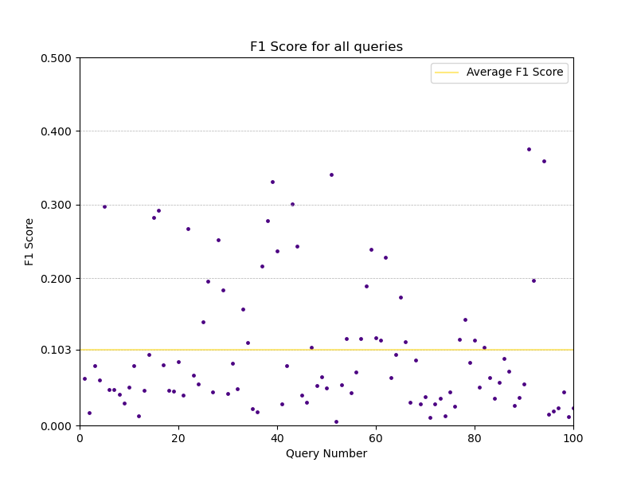

# Relatório do Trabalho de Avaliação do MEcanismo de Busca

## 0. Construção de gráficos e obtenção dos dados

Todo o processo de construção dos gráficos, assim como a estruturação dos dados que os compõem, estão especificados em um notebook do Jupyter presente no diretório `src`, de nome `Avaliacao.ipynb`. Dentro dele temos as criações para os gráficos dos resultados do mecanismo de busca utilizando stemmer. Os gráficos para o mecanismo que não utilizam o stemmer, foram criados utilizando o mesmo notebook, mas apenas mudando o arquivo que é passado em seu início. 

Como era esperado, os arquivos CSV que foram utilizados para fazer os gráficos estão no diretório `avalia`, assim como eles próprios. O README do mecanismo foi atualizado indicando a mudança que foi implementada para utilizar ou não o stemmer. Mais detalhes sobre a criação das métricas de avaliação podem ser encontradas dentro do próprio notebook.

## 1. Gráfico de 11 pontos de precisão e recall

* Stemmer

* NoStemmer

## 2. $F_1$ score

* Stemmer

* NoStemmer

## 3. Precision@5

* Stemmer

* NoStemmer

## 4. Precision@10

* Stemmer

* NoStemmer

## 5. Histograma Comparativo de R-Precision

## 6. MAP

* Stemmer

* NoStemmer

## 7. MRR

* Stemmer

* NoStemmer

## 8. Discounted Cumulative Gain

* Stemmer

* NoStemmer

## 9. Normalized Discounted Cumulative Gain

* Stemmer

* NoStemmer

